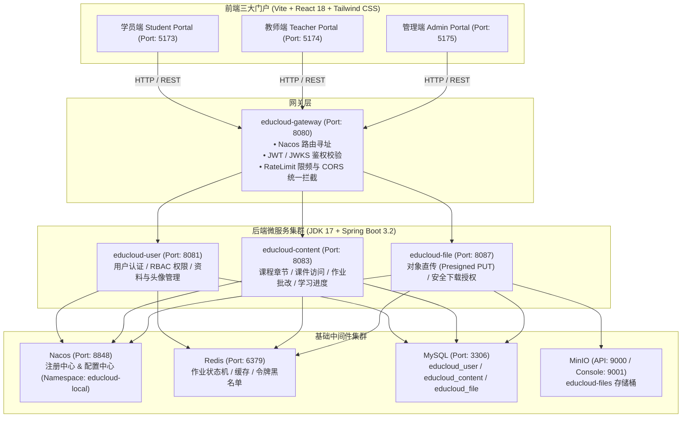
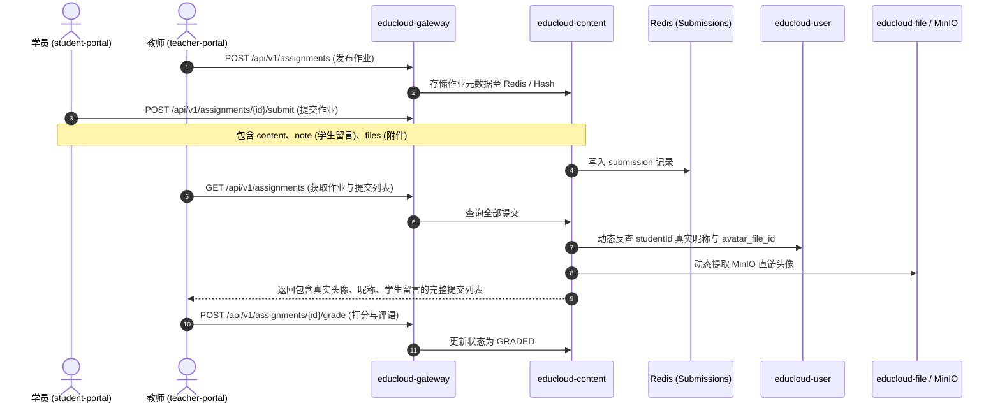

# EduCloud 微服务在线教育平台 — 模块开发交接文档

> **文档版本**：v1.0.0  
> **交接日期**：2026-08-27  
> **适用对象**：接手 EduCloud 项目后续功能模块开发、运维与架构演进的工程师

---

## 目录
1. [系统整体架构与技术栈](#1-系统整体架构与技术栈)
2. [微服务与工程目录清单](#2-微服务与工程目录清单)
3. [本次迭代完成的核心攻坚与成果](#3-本次迭代完成的核心攻坚与成果)
4. [环境配置与服务访问入口](#4-环境配置与服务访问入口)
5. [核心账号体系与测试数据](#5-核心账号体系与测试数据)
6. [关键业务链路与开发规范说明](#6-关键业务链路与开发规范说明)
7. [常见运维操作与排查手册](#7-常见运维操作与排查手册)
8. [下一个模块规划建议与交接说明](#8-下一个模块规划建议与交接说明)

---

## 1. 系统整体架构与技术栈

EduCloud 是一个基于 **Spring Cloud Alibaba + React 18 / Vue 3 + TypeScript + MinIO** 构建的现代化微服务在线教育平台。



---

## 2. 微服务与工程目录清单

### 2.1 后端工程 (`d:\microservice\educloud-backend`)
| 模块名 | 端口 | 核心职责 | 依赖数据库/中间件 |
| :--- | :--- | :--- | :--- |
| `educloud-gateway` | `8080` | 微服务统一流量入口、路由分发、限频（HMAC）、JWKS 统一鉴权 | Nacos, Redis |
| `educloud-user` | `8081` | 用户账号体系、注册登录、OAuth2/JWT 签发、用户资料与头像 | MySQL (`educloud_user`), Redis |
| `educloud-content` | `8083` | 课程内容、章节管理、作业发布/提交/批改、考试中心 | MySQL (`educloud_content`), Redis |
| `educloud-file` | `8087` | 文件上传会话（Presigned PUT）、下载授权（Presigned GET）、对象元数据审计 | MySQL (`educloud_file`), MinIO |
| `educloud-common` | - | 通用公共组件包、统一响应体 `ApiResponse`、业务异常错误码、工具类 | - |

### 2.2 前端工程 (`d:\microservice\educloud-frontend`)
| 模块名 | 端口 | 技术栈 | 核心职责 |
| :--- | :--- | :--- | :--- |
| `student-portal` | `5173` | React 18 + Vite + Tailwind CSS + Lucide Icons | 学员端：课程选购与学习、作业提交、在线考试、个人中心 |
| `teacher-portal` | `5174` | React 18 + Vite + Tailwind CSS + Lucide Icons | 教师端：工作台、课程发布、内容编排、作业批改、学员进度追踪 |
| `admin-portal` | `5175` | React 18 + Vite + Tailwind CSS + Lucide Icons | 管理端：平台运维监控、用户管理、内容审核、权限配置 |

---

## 3. 本次迭代完成的核心攻坚与成果

### ① 生产级多租户与多账号数据完全隔离
- **解决痛点**：此前新注册学生账号与演示账号（`fe_demo_10`）由于本地存储 Key 或接口未隔离，导致新账号会展示其他账号的学习记录与作业。
- **改造措施**：
  - 前端引入动态账号隔离键生成机制 `getUserStorageKey(prefix)`；
  - 作业提交与查询微服务直连基于真实登录态 `studentId`，实现多学员数据 100% 物理隔离。

### ② 学员真实姓名与真实头像动态解析
- **解决痛点**：此前教师端作业批改列表只显示“学员”占位符，或头像回退为英文缩写徽标（`TE`、`LJ`）。
- **改造措施**：
  - 在 `educloud-content` 的 `AssignmentService` 中集成 `JdbcTemplate` 跨库反查 `educloud_user.sys_user` 与 `user_profile`；
  - 自动提取 `avatar_file_id` 并关联 `educloud_file.file_object`，生成带有效 MinIO 直链的真实头像地址；
  - 赋予 MinIO `educloud-files` 存储桶公共读取策略，解决浏览器原生 `` 标签因无法携带 Token 导致的 401 拦截。

### ③ 教师端作业批改界面体验升级
- **双独立滚动滑块（Custom Scrollbar）**：
  - 左侧作业列表与中间学生提交列表均增加了固定最大高度与平滑滚动条，防止作业与学员数量较多时页面被无限制拉长。
- **学生“向授课教师留言”独立高亮展示**：
  - 在教师批改详情页顶部新增黄色微卡片（`bg-amber-50/70`），以 `MessageSquareQuote` 图标高亮展示学生提交作业时填写的附言与疑难留言；未留言时自动优雅收起。
- **提交附件全览**：
  - 作业正文下方新增附件卡片列表，直观展示附件名称、大小并提供下载直链。
- **UI 对齐修复**：
  - 评分与状态徽标全部居中对齐，修复了“查看批改”多字换行问题。

### ④ 网关路由与配置体系标准化
- 修复 `RouteGroups.java` 与 `application.yml`，统一所有服务的 Nacos 命名空间为 `educloud-local`；
- 补齐了包括 `/api/v1/assignments`、`/api/v1/submissions`、`/api/v1/exams` 在内的根路由规则与 JWKS 验签密钥配置。

---

## 4. 环境配置与服务访问入口

| 服务 / 组件 | 地址 / 端口 | 账号 / 密码 / 凭证 |
| :--- | :--- | :--- |
| **虚拟机服务器** | `192.168.100.136` | `root` / `1` |
| **学员端 Portal** | `http://192.168.100.136:5173` | 可使用下文学员账号登录 |
| **教师端 Portal** | `http://192.168.100.136:5174` | 可使用下文教师账号登录 |
| **管理端 Portal** | `http://192.168.100.136:5175` | 可使用管理员账号登录 |
| **API 网关接口** | `http://192.168.100.136:8080` | Bearer JWT 访问 |
| **Nacos 控制台** | `http://192.168.100.136:8848/nacos` | `nacos` / `nacos`（Namespace: `educloud-local`） |
| **MinIO 控制台** | `http://192.168.100.136:9001` | `educloud_local_admin` / `b4139c212355ef9ef5326c36bb992860e4dc479875316eef` |
| **Redis 服务** | `192.168.100.136:6379` | 密码：`c4d463f0a8cd8a0daf3558ec08e772f2cb2d26c4aabd52b6` |
| **MySQL 数据库** | `192.168.100.136:3306` | root 密码：`39c3df909277146fa5a381c6cb98752c5570a23724ec14a8` |

---

## 5. 核心账号体系与测试数据

| 角色类型 | 登录账号 (Username / Email) | 登录密码 | 展示昵称 | 说明 |
| :--- | :--- | :--- | :--- | :--- |
| **教师账号** | `demo_teacher@educloud.cn` | `EduCloud@2026` | 示范教师 | 拥有全部课程授课、作业发布、作业批改权限 |
| **学员演示账号** | `fe_demo_10` / `fe_demo_10@educloud.local` | `EduCloud@2026` | LJC | 经典学员账号（已绑定初音未来头像） |
| **学员测试账号** | `test2` / `test2@qq.com` | `Password123!` | test2 | 动态注册的新学员账号（已绑定五条悟头像） |

---

## 6. 关键业务链路与开发规范说明

### 6.1 作业流转全生命周期


### 6.2 跨服务代码调用规范
- 所有对外暴露的微服务路由必须在 `educloud-gateway` 中的 `RouteGroups.java` 注册白名单或鉴权路径；
- 文件服务下载 URL 优先通过 S3 签名或经过 MinIO 桶安全策略下发；
- 前端与后端交互统一采用标准响应结构体 `ApiResponse<T>`（包含 `code`, `message`, `data`, `timestamp`）。

---

## 7. 常见运维操作与排查手册

### ① 后端服务打包与部署
```bash
# 1. 本地编译打包 (例如 educloud-content)
mvn clean package -pl educloud-content -am -DskipTests

# 2. 上传 Jar 包至虚拟机并重启进程
scp educloud-content/target/educloud-content-1.0.0-SNAPSHOT.jar root@192.168.100.136:/root/educloud/...
# 杀死旧进程并后台启动
pkill -f educloud-content
nohup java -jar educloud-content-1.0.0-SNAPSHOT.jar > /tmp/content.log 2>&1 &
```

### ② 前端热更新与同步
- 前端源码位于 `d:\microservice\educloud-frontend`；
- 修改后可通过 Python 脚本或 SSH 实时同步到虚拟机的 `/root/educloud/.worktrees/educloud-backend-foundation/educloud-frontend/` 目录，Vite 开发服务器将自动热更新（HMR）。

---

## 8. 下一个模块规划建议与交接说明

### 8.1 推荐后续推进的重点模块
1. **在线直播与互动课堂模块（`educloud-live`）**：
   - 包含教师开播推流、学员拉流观看、RTC 低延迟互动、实时弹幕与课堂白板；
   - 依赖中间件：SRS / LiveKit 流媒体服务器、WebSocket 消息网关。
2. **智能题库与自动阅卷系统（`educloud-exam`）**：
   - 包含客观题（单选/多选/判断）自动秒批、主观题 AI 辅助判卷、防作弊切屏抓拍监控。
3. **订单支付与交易结算闭环（`educloud-order` / `educloud-payment`）**：
   - 微信支付/支付宝沙箱对接、订单状态机流转、退款与发票管理。

---

*（文档已归档至项目根目录 `docs/HANDOVER.md`，可随时查阅并提交至 Git 仓库）*
