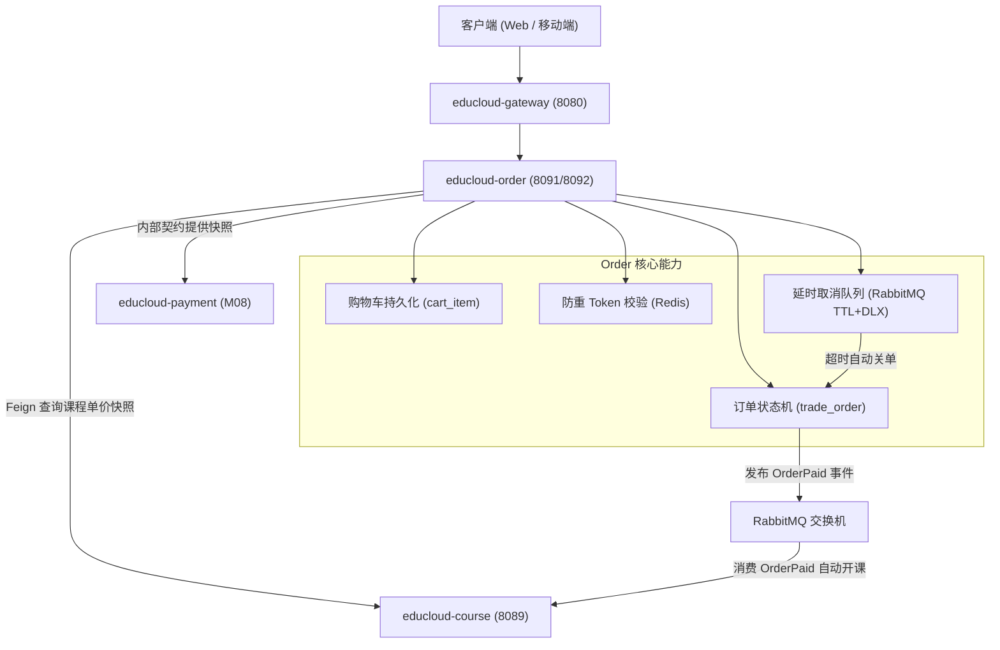

# M07 educloud-order（订单中心）技术设计规格

> 状态：已批准  
> 日期：2026-08-24  
> 模块：M07 `educloud-order`（订单中心微服务）  
> 关联契约：
> - [`2026-08-18-educloud-services-and-domains.md`](./2026-08-18-educloud-services-and-domains.md)
> - [`2026-08-18-educloud-data-design.md`](./2026-08-18-educloud-data-design.md)
> - [`2026-08-18-educloud-api-and-integration.md`](./2026-08-18-educloud-api-and-integration.md)
> - [`2026-08-20-educloud-backend-module-execution.md`](./2026-08-20-educloud-backend-module-execution.md)

---

## 1. 模块定位与总体架构

`educloud-order` 作为在线教育平台的核心交易枢纽，负责管理购物车、生成权威价格快照订单、维护订单状态机、执行防重提单与延时超时自动关单，并在支付完成后通过领域事件驱动下游服务进行自动开课履约。



### 1.1 基础配置与端口
- **模块目录**：`educloud-backend/educloud-order`
- **业务端口**：`8091`
- **管理/监控端口**：`8092`
- **注册与配置中心**：Nacos（`192.168.100.136:8848`）
- **中间件依赖**：
  - MySQL 8.0（逻辑库 `educloud_order`）
  - Redis（防重 Token、缓存）
  - RabbitMQ（死信延时取消、`OrderPaid` 事件广播）

---

## 2. 数据库设计（`educloud_order` 逻辑库）

字符集统一配置为 `DEFAULT CHARSET=utf8mb4 COLLATE=utf8mb4_unicode_ci`，主键全部使用雪花算法 `BIGINT`。

### 2.1 购物车表 `cart_item`
```sql
CREATE TABLE IF NOT EXISTS `cart_item` (
  `id` BIGINT NOT NULL COMMENT '主键ID（雪花算法）',
  `student_id` BIGINT NOT NULL COMMENT '学员ID',
  `course_id` BIGINT NOT NULL COMMENT '课程ID',
  `selected` TINYINT(1) NOT NULL DEFAULT 1 COMMENT '是否勾选结算: 1-是, 0-否',
  `created_at` DATETIME NOT NULL DEFAULT CURRENT_TIMESTAMP COMMENT '创建时间',
  `updated_at` DATETIME NOT NULL DEFAULT CURRENT_TIMESTAMP ON UPDATE CURRENT_TIMESTAMP COMMENT '更新时间',
  PRIMARY KEY (`id`),
  UNIQUE KEY `uk_student_course` (`student_id`, `course_id`),
  KEY `idx_student_selected` (`student_id`, `selected`)
) ENGINE=InnoDB DEFAULT CHARSET=utf8mb4 COLLATE=utf8mb4_unicode_ci COMMENT='学员购物车项表';
```

### 2.2 交易订单主表 `trade_order`
```sql
CREATE TABLE IF NOT EXISTS `trade_order` (
  `id` BIGINT NOT NULL COMMENT '订单ID（雪花算法）',
  `order_no` VARCHAR(64) NOT NULL COMMENT '业务订单流水号（ORD+日期+雪花）',
  `student_id` BIGINT NOT NULL COMMENT '下单学员ID',
  `status` VARCHAR(32) NOT NULL DEFAULT 'PENDING_PAYMENT' COMMENT '状态: PENDING_PAYMENT, PAID, CANCELLED, REFUNDED',
  `original_amount` DECIMAL(10, 2) NOT NULL COMMENT '订单原价（元）',
  `payable_amount` DECIMAL(10, 2) NOT NULL COMMENT '应付金额（元）',
  `currency` VARCHAR(8) NOT NULL DEFAULT 'CNY' COMMENT '币种',
  `expires_at` DATETIME NOT NULL COMMENT '支付截止时间（默认下单+15分钟）',
  `paid_at` DATETIME DEFAULT NULL COMMENT '支付完成时间',
  `cancelled_at` DATETIME DEFAULT NULL COMMENT '订单取消/关闭时间',
  `idempotency_key_hash` VARCHAR(64) DEFAULT NULL COMMENT '幂等防重Key哈希',
  `version` INT NOT NULL DEFAULT 0 COMMENT '乐观锁版本号',
  `created_at` DATETIME NOT NULL DEFAULT CURRENT_TIMESTAMP COMMENT '创建时间',
  `updated_at` DATETIME NOT NULL DEFAULT CURRENT_TIMESTAMP ON UPDATE CURRENT_TIMESTAMP COMMENT '更新时间',
  PRIMARY KEY (`id`),
  UNIQUE KEY `uk_order_no` (`order_no`),
  UNIQUE KEY `uk_student_idempotency` (`student_id`, `idempotency_key_hash`),
  KEY `idx_student_status` (`student_id`, `status`),
  KEY `idx_created_at` (`created_at`)
) ENGINE=InnoDB DEFAULT CHARSET=utf8mb4 COLLATE=utf8mb4_unicode_ci COMMENT='交易订单主表';
```

### 2.3 订单明细项表 `trade_order_item`
```sql
CREATE TABLE IF NOT EXISTS `trade_order_item` (
  `id` BIGINT NOT NULL COMMENT '明细ID（雪花算法）',
  `order_id` BIGINT NOT NULL COMMENT '关联订单ID',
  `course_id` BIGINT NOT NULL COMMENT '购买课程ID',
  `course_title_snapshot` VARCHAR(255) NOT NULL COMMENT '课程标题快照',
  `cover_file_id_snapshot` BIGINT DEFAULT NULL COMMENT '封面文件ID快照',
  `unit_price` DECIMAL(10, 2) NOT NULL COMMENT '成交单价（元）',
  `quantity` INT NOT NULL DEFAULT 1 COMMENT '数量（课程固定为1）',
  `line_amount` DECIMAL(10, 2) NOT NULL COMMENT '明细行总额（元）',
  `refund_reserved_amount` DECIMAL(10, 2) NOT NULL DEFAULT 0.00 COMMENT '退款预留中金额',
  `refunded_amount` DECIMAL(10, 2) NOT NULL DEFAULT 0.00 COMMENT '已退款金额',
  `fulfillment_status` VARCHAR(32) NOT NULL DEFAULT 'UNFULFILLED' COMMENT '履约状态: UNFULFILLED, FULFILLED, REVOKED',
  `created_at` DATETIME NOT NULL DEFAULT CURRENT_TIMESTAMP COMMENT '创建时间',
  `updated_at` DATETIME NOT NULL DEFAULT CURRENT_TIMESTAMP ON UPDATE CURRENT_TIMESTAMP COMMENT '更新时间',
  PRIMARY KEY (`id`),
  UNIQUE KEY `uk_order_course` (`order_id`, `course_id`),
  KEY `idx_order_id` (`order_id`),
  KEY `idx_course_id` (`course_id`)
) ENGINE=InnoDB DEFAULT CHARSET=utf8mb4 COLLATE=utf8mb4_unicode_ci COMMENT='订单明细项表';
```

### 2.4 退款申请主表与明细表
- `refund_request`：`id`, `refund_no`, `order_id`, `student_id`, `requested_amount`, `reason`, `status` (`PENDING_REVIEW`, `APPROVED`, `REJECTED`, `SUCCESS`), `reviewed_by`, `review_reason`, `version`, 审计字段。
- `refund_request_item`：`id`, `refund_request_id`, `order_item_id`, `course_id`, `requested_amount`, `approved_amount`。
- 退款金额约束：必须满足 `refund_reserved_amount + refunded_amount <= line_amount`。

---

## 3. 核心机制设计

### 3.1 订单状态机
- **状态集合**：`PENDING_PAYMENT`（待支付）、`PAID`（已支付）、`CANCELLED`（已取消/超时关闭）、`REFUNDED`（已退款）。
- **流转规则**：
  1. `PENDING_PAYMENT` -> `PAID`：通过模拟支付或接收 M08 支付成功事件，记录 `paid_at`，发布 `OrderPaid` 事件；
  2. `PENDING_PAYMENT` -> `CANCELLED`：通过学生主动取消或 15 分钟死信队列超时取消，CAS 更新 `cancelled_at`，发布 `OrderCancelled` 事件；
  3. `PAID` -> `REFUNDED`：通过退款审核全额退款后流转，发布 `OrderRefunded` 事件；
  4. 终态保护：`PAID` 订单禁止调用 `cancel` 接口；`CANCELLED` 和 `REFUNDED` 不可逆。

### 3.2 幂等防重机制
1. 前端进入结算页面调用 `GET /api/v1/orders/idempotency-token` 获取 Redis Token（TTL 10 分钟）；
2. 下单请求 Header 附带 `X-Idempotency-Key`；
3. 后端首先通过 Redis Lua 脚本校验并删除 Token，未获取到则返回 `409 DUPLICATE_SUBMISSION`；
4. 数据库层面由 `UNIQUE KEY uk_student_idempotency (student_id, idempotency_key_hash)` 提供双重并发落库兜底。

### 3.3 RabbitMQ TTL + 死信（DLX）超时关单
1. **订单创建成功**：构建延时消息发往普通延迟队列：
   - 队列名：`educloud.order.delay.queue`
   - 参数：`x-message-ttl = 900000`（15 分钟，测试环境支持 profile 设为 60s）
   - 死信配置：`x-dead-letter-exchange = educloud.order.dlx.exchange`，`x-dead-letter-routing-key = order.cancel`
2. **死信队列与消费者**：
   - 交换机：`educloud.order.dlx.exchange`（Direct）
   - 队列：`educloud.order.cancel.queue`，绑定 RoutingKey `order.cancel`
   - 关单消费者逻辑：检查订单是否仍为 `PENDING_PAYMENT`。若是，执行带乐观锁的 CAS 更新并发布 `OrderCancelled`。

### 3.4 价格快照与选课履约
1. **提单查价**：提单时通过 OpenFeign 请求 `educloud-course` 获取指定课程的当前发布状态与价格，计算 `payable_amount` 并固化在 `trade_order_item` 中。
2. **支付履约**：
   - 触发方式：测试接口 `POST /api/v1/orders/{id}/mock-pay` 或消费 RabbitMQ `PaymentSucceeded`；
   - 状态流转为 `PAID` 并向交换机 `educloud.order.exchange` 发布 `OrderPaid` 事件（携带 `orderId`、`studentId`、`courseIds`）；
   - `educloud-course` 监听 `OrderPaid` 事件，幂等写入 `course_enrollment`（选课成功）。

---

## 4. API 契约设计（统一前缀 `/api/v1`）

所有接口返回统一包装格式 `Result<T>`，所有 Long 型 ID 统一按 JSON String 序列化。

### 4.1 购物车端点
- `GET /api/v1/cart`：获取当前登录学员购物车列表
- `POST /api/v1/cart/items`：添加课程到购物车（请求体：`{ "courseId": "..." }`）
- `DELETE /api/v1/cart/items/{courseId}`：移出购物车
- `PUT /api/v1/cart/items/{courseId}/selection`：切换勾选状态（请求体：`{ "selected": true/false }`）

### 4.2 订单端点（学生端）
- `GET /api/v1/orders/idempotency-token`：生成防重 Token
- `POST /api/v1/orders`：创建订单（支持 `courseId` 单课立即结算，或不传参数从购物车勾选结算）
- `GET /api/v1/orders`：分页查询当前学员订单列表（支持 `status` 过滤）
- `GET /api/v1/orders/{id}`：查询订单详情（明细项、金额、倒计时）
- `POST /api/v1/orders/{id}/cancel`：主动取消待支付订单
- `POST /api/v1/orders/{id}/mock-pay`：测试环境模拟支付（更新 PAID 并触发开课）

### 4.3 管理端点
- `GET /api/v1/admin/orders`：管理端全量分页查询订单列表与明细
- `POST /api/v1/admin/refund-requests/{id}/review`：审核退款申请（通过/驳回）

### 4.4 内部微服务调用契约（Feign）
- `GET /internal/v1/orders/{id}/payable-snapshot`：供 Payment 校验订单应收明细
- `GET /internal/v1/orders/{id}/fulfillment-snapshot`：供 Course/Refund 校验履约状态

---

## 5. 前端三端联动适配

1. **学生端（5173）**：
   - 课程详情页：对接“立即购买”直达结算；
   - 结算页：对接防重 Token、提单、拉起模拟支付面板；
   - 订单列表（`/orders`）：展示订单卡片、支付倒计时、去支付、取消订单与直达学习页按钮。
2. **管理端（5175）**：
   - 订单管理（`/orders`）：展示真实订单流水、购买学员、订单金额与单行状态徽标。
3. **教师端（5174）**：
   - 课程学员列表：查看支付成功后自动选课的真实学员。
