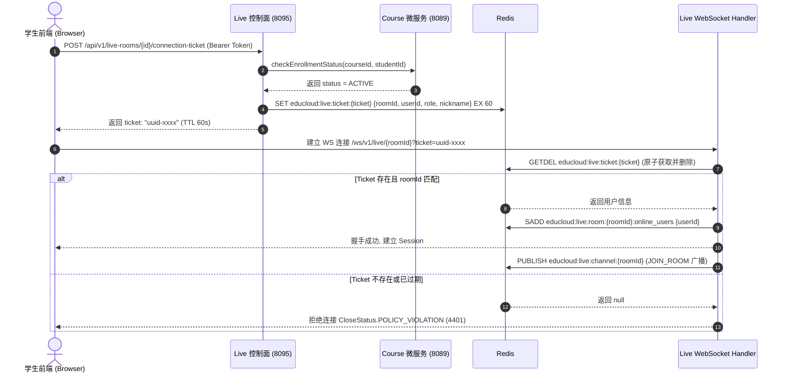

# M09 直播互动中心（educloud-live）系统设计与规格说明

> 模块：`educloud-live` 直播互动中心与 WebSocket 课堂  
> 日期：2026-08-25  
> 状态：APPROVED (头脑风暴与架构评审通过)

---

## 1. 业务背景与设计目标

### 1.1 业务背景
EduCloud 在完成课程、订单与支付中心（M08）闭环后，亟需构建面向师生实时互动的直播教学中心。直播互动中心（`educloud-live`）负责管理直播间的全生命周期、生成并管理推拉流凭证、提供基于 WebSocket 的低延迟互动教室（弹幕、点赞、举手、实时白板信令、全员禁言、消息撤回）、管理学生出勤时长，并在直播结束后自动归档录制回放并对接文件中心（`educloud-file`）完成受控点播。

### 1.2 核心目标
1. **控制面与生命周期管理**：提供直播间的创建、编辑、排期、开播、下播与取消功能，使用 CAS 乐观锁防并发竞争，确保状态机单向可控。
2. **统一 Stream Provider SPI 插件体系**：抽象推拉流控制面接口，默认实现沙箱级 `MockLiveStreamProvider`，支持在无需外部流媒体服务器的情况下完成 100% 单元测试与 E2E 自动化验收，同时预留对接阿里云、腾讯云、SRS/ZLMediaKit 的扩展能力。
3. **安全长连接与 WebSocket 互动教室**：
   - 解决原生浏览器 WebSocket 无法携带自定义 HTTP Header 的问题，设计 60s 一次性短效 Ticket 机制，结合 Redis `GETDEL` 原子核销，防止 Token 泄露与重放攻击；
   - 联动 `educloud-course` 选课中心，严格核验学员有效选课状态（`ACTIVE`）；
   - 基于 Spring Boot 原生 WebSocket (`TextWebSocketHandler`) + Redis Pub/Sub 实现集群化多实例消息跨节点广播与在线人数统计。
4. **回放归档与受控授权**：直播结束后自动生成回放记录（`live_replay`），学生点播时核验有效选课，并通过 `educloud-file` 内部下载授权接口换取短期签名点播 URL。
5. **门禁与稳定性**：遵循双端口监控标准（业务 8095 / 监控 8096），单元测试与集成测试覆盖率 100%，前端三端 TypeScript 构建 0 错误。

---

## 2. 总体架构与网络拓扑

### 2.1 服务与端口规划
- **服务名称**：`educloud-live`
- **代码目录**：`educloud-backend/educloud-live`
- **业务/WebSocket 端口**：`8095`
- **Actuator 监控端口**：`8096`（只绑定 `127.0.0.1` 供健康探测）
- **网关路由规则（`educloud-gateway`）**：
  - REST 接口：`/api/v1/live-rooms/**` ➔ `lb://educloud-live`
  - WebSocket 长连接：`/ws/v1/live/**` ➔ `lb:ws://educloud-live`

### 2.2 架构分层
```text
+-------------------------------------------------------------------------+
|                  Student / Teacher / Admin Frontends                    |
+-------------------------------------------------------------------------+
                                    |
                    +---------------+---------------+
                    | HTTP REST                     | Native WebSocket
                    v                               v
+-------------------------------------------------------------------------+
|                    Gateway (8080) [lb://educloud-live, lb:ws://]         |
+-------------------------------------------------------------------------+
                                    |
+-----------------------------------+-------------------------------------+
|                      educloud-live (8095 / 8096)                        |
|  +---------------------+  +---------------------+  +-----------------+  |
|  | LiveRoomController  |  | LiveWebSocketHandler|  | LiveReplayCtrl  |  |
|  +---------------------+  +---------------------+  +-----------------+  |
|            |                         |                      |           |
|  +---------------------+  +---------------------+  +-----------------+  |
|  | LiveLifecycleService|  | LiveMessageService  |  | LiveReplayServ  |  |
|  +---------------------+  +---------------------+  +-----------------+  |
|            |                         |                      |           |
|  +---------------------+  +---------------------+  +-----------------+  |
|  | StreamProvider SPI  |  | Redis Room BroadCast|  | Feign Clients   |  |
|  | (Mock / Cloud / SRS)|  | (Pub/Sub & Sets)    |  | (Course / File) |  |
|  +---------------------+  +---------------------+  +-----------------+  |
+-----------------------------------+-------------------------------------+
                                    |
         +--------------------------+--------------------------+
         |                          |                          |
         v                          v                          v
+-----------------+        +-----------------+        +-----------------+
|   MySQL 8.0     |        |   Redis Cluster |        | RabbitMQ / Outbox
|  (live_room,    |        | (Ticket, Pub/Sub|        | (LiveStarted,   |
|   live_session, |        |  Online Users)  |        |  LiveEnded)     |
|   live_message, |        +-----------------+        +-----------------+
|   live_replay)  |
+-----------------+
```

---

## 3. 数据模型设计

### 3.1 数据库表结构（`deploy/sql/live/V001__live_control_plane.sql`）

```sql
-- 1. 直播间表
CREATE TABLE `live_room` (
  `id` BIGINT NOT NULL COMMENT '直播间ID (雪花算法)',
  `course_id` BIGINT NOT NULL COMMENT '关联课程ID',
  `teacher_id` BIGINT NOT NULL COMMENT '主讲教师ID',
  `title` VARCHAR(128) NOT NULL COMMENT '直播间标题',
  `description` VARCHAR(1024) NULL COMMENT '直播间简介',
  `scheduled_start_at` DATETIME NOT NULL COMMENT '计划开播时间',
  `scheduled_end_at` DATETIME NOT NULL COMMENT '计划结束时间',
  `status` VARCHAR(32) NOT NULL DEFAULT 'CREATED' COMMENT '状态: CREATED(未开播), LIVING(直播中), ENDED(已下播), CANCELLED(已取消)',
  `provider_type` VARCHAR(32) NOT NULL DEFAULT 'MOCK' COMMENT '流媒体供应商: MOCK, ALIYUN, TENCENT, SRS',
  `stream_key` VARCHAR(128) NOT NULL COMMENT '推流唯一标识码',
  `allow_chat` TINYINT(1) NOT NULL DEFAULT 1 COMMENT '是否允许弹幕(1-允许, 0-全员禁言)',
  `version` BIGINT NOT NULL DEFAULT 0 COMMENT 'CAS乐观锁版本号',
  `created_at` DATETIME NOT NULL DEFAULT CURRENT_TIMESTAMP,
  `updated_at` DATETIME NOT NULL DEFAULT CURRENT_TIMESTAMP ON UPDATE CURRENT_TIMESTAMP,
  `deleted` TINYINT NOT NULL DEFAULT 0,
  PRIMARY KEY (`id`),
  INDEX `idx_course_id` (`course_id`),
  INDEX `idx_teacher_id` (`teacher_id`),
  INDEX `idx_status` (`status`)
) ENGINE=InnoDB DEFAULT CHARSET=utf8mb4 COMMENT='直播间表';

-- 2. 直播场次记录表
CREATE TABLE `live_session` (
  `id` BIGINT NOT NULL COMMENT '场次ID (雪花算法)',
  `room_id` BIGINT NOT NULL COMMENT '直播间ID',
  `session_no` INT NOT NULL DEFAULT 1 COMMENT '场次序号',
  `status` VARCHAR(32) NOT NULL DEFAULT 'LIVING' COMMENT '场次状态: LIVING, ENDED',
  `started_at` DATETIME NOT NULL COMMENT '实际开播时间',
  `ended_at` DATETIME NULL COMMENT '实际结课时间',
  `started_by` BIGINT NOT NULL COMMENT '开播操作人',
  `ended_by` BIGINT NULL COMMENT '结课操作人',
  `peak_viewers` INT NOT NULL DEFAULT 0 COMMENT '最高在线人数峰值',
  `total_viewers` INT NOT NULL DEFAULT 0 COMMENT '累计观看人次',
  `created_at` DATETIME NOT NULL DEFAULT CURRENT_TIMESTAMP,
  `updated_at` DATETIME NOT NULL DEFAULT CURRENT_TIMESTAMP ON UPDATE CURRENT_TIMESTAMP,
  `deleted` TINYINT NOT NULL DEFAULT 0,
  PRIMARY KEY (`id`),
  INDEX `idx_room_id` (`room_id`),
  INDEX `idx_status` (`status`)
) ENGINE=InnoDB DEFAULT CHARSET=utf8mb4 COMMENT='直播场次记录表';

-- 3. 课堂弹幕与信令消息表
CREATE TABLE `live_message` (
  `id` BIGINT NOT NULL COMMENT '消息ID (雪花算法)',
  `room_id` BIGINT NOT NULL COMMENT '直播间ID',
  `session_id` BIGINT NOT NULL COMMENT '场次ID',
  `sender_id` BIGINT NOT NULL COMMENT '发送人ID',
  `sender_name` VARCHAR(64) NOT NULL COMMENT '发送人昵称/姓名',
  `sender_role` VARCHAR(32) NOT NULL COMMENT '发送人角色: TEACHER, STUDENT, ASSISTANT, SYSTEM',
  `message_type` VARCHAR(32) NOT NULL DEFAULT 'CHAT' COMMENT '类型: CHAT, LIKE, HAND_UP, WHITEBOARD, SYSTEM',
  `content` TEXT NOT NULL COMMENT '消息正文或信令负载 JSON',
  `status` VARCHAR(32) NOT NULL DEFAULT 'NORMAL' COMMENT '状态: NORMAL, RECALLED, BLOCKED',
  `sent_at` DATETIME NOT NULL DEFAULT CURRENT_TIMESTAMP COMMENT '发送时间戳',
  `recalled_at` DATETIME NULL COMMENT '撤回时间',
  `recalled_by` BIGINT NULL COMMENT '撤回操作人',
  PRIMARY KEY (`id`),
  INDEX `idx_session_time` (`session_id`, `sent_at`),
  INDEX `idx_room_time` (`room_id`, `sent_at`)
) ENGINE=InnoDB DEFAULT CHARSET=utf8mb4 COMMENT='课堂弹幕与信令持久化表';

-- 4. 学生出勤与观看时长统计表
CREATE TABLE `live_attendance` (
  `id` BIGINT NOT NULL COMMENT '出勤记录ID',
  `room_id` BIGINT NOT NULL COMMENT '直播间ID',
  `session_id` BIGINT NOT NULL COMMENT '场次ID',
  `student_id` BIGINT NOT NULL COMMENT '学员ID',
  `joined_at` DATETIME NOT NULL COMMENT '首次进入时间',
  `last_active_at` DATETIME NOT NULL COMMENT '最后活跃时间',
  `left_at` DATETIME NULL COMMENT '退出时间',
  `watched_seconds` BIGINT NOT NULL DEFAULT 0 COMMENT '累计观看时长(秒)',
  `created_at` DATETIME NOT NULL DEFAULT CURRENT_TIMESTAMP,
  `updated_at` DATETIME NOT NULL DEFAULT CURRENT_TIMESTAMP ON UPDATE CURRENT_TIMESTAMP,
  PRIMARY KEY (`id`),
  UNIQUE KEY `uk_session_student` (`session_id`, `student_id`),
  INDEX `idx_student_room` (`student_id`, `room_id`)
) ENGINE=InnoDB DEFAULT CHARSET=utf8mb4 COMMENT='直播出勤与观看时长表';

-- 5. 录制回放表
CREATE TABLE `live_replay` (
  `id` BIGINT NOT NULL COMMENT '回放ID (雪花算法)',
  `room_id` BIGINT NOT NULL COMMENT '直播间ID',
  `session_id` BIGINT NOT NULL COMMENT '场次ID',
  `file_id` BIGINT NOT NULL COMMENT '关联 File 服务文件ID',
  `title` VARCHAR(128) NOT NULL COMMENT '回放标题',
  `duration_seconds` BIGINT NOT NULL DEFAULT 0 COMMENT '回放视频时长(秒)',
  `size_bytes` BIGINT NOT NULL DEFAULT 0 COMMENT '视频文件大小(字节)',
  `status` VARCHAR(32) NOT NULL DEFAULT 'AVAILABLE' COMMENT '状态: PENDING, AVAILABLE, FAILED, DELETED',
  `available_at` DATETIME NOT NULL DEFAULT CURRENT_TIMESTAMP COMMENT '回放可用时间',
  `created_at` DATETIME NOT NULL DEFAULT CURRENT_TIMESTAMP,
  `updated_at` DATETIME NOT NULL DEFAULT CURRENT_TIMESTAMP ON UPDATE CURRENT_TIMESTAMP,
  `deleted` TINYINT NOT NULL DEFAULT 0,
  PRIMARY KEY (`id`),
  INDEX `idx_room_id` (`room_id`),
  INDEX `idx_session_id` (`session_id`)
) ENGINE=InnoDB DEFAULT CHARSET=utf8mb4 COMMENT='录制回放表';
```

---

## 4. 核心业务流程与机制

### 4.1 直播间生命周期与 CAS 状态流转
- **创建直播间（`POST /api/v1/live-rooms`）**：
  - 校验用户具有 `live:create` 权限且当前用户为教师（或管理角色）；
  - 校验 `course_id` 归属该教师；
  - 生成 64 位雪花 `id` 与唯一 `stream_key`，初始状态为 `CREATED`。
- **教师开播（`POST /api/v1/live-rooms/{id}/start`）**：
  - 核验教师身份（`teacher_id == currentUser.id || isAdmin`）；
  - CAS 更新状态：`UPDATE live_room SET status = 'LIVING', version = version + 1 WHERE id = ? AND status = 'CREATED' AND deleted = 0`；
  - 创建并插入 `live_session` 记录（`status = 'LIVING', started_by = currentUser.id`）；
  - 调用 `LiveStreamProvider.generatePushUrl(room)` 生成推流地址返回给教师端；
  - 广播 `ROOM_STATUS_CHANGED` 信令。
- **教师下播（`POST /api/v1/live-rooms/{id}/end`）**：
  - CAS 更新状态：`UPDATE live_room SET status = 'ENDED', version = version + 1 WHERE id = ? AND status = 'LIVING' AND deleted = 0`；
  - 更新当前 `live_session` 记录为 `ENDED`，更新统计数据；
  - 自动插入一条默认 `live_replay` 记录（状态 `AVAILABLE`，绑定测试 Mock File ID，支持点播）；
  - 广播下播结课信令，平滑通知长连接客户端。

### 4.2 60s 一次性 WebSocket Ticket 握手安全流程


### 4.3 Redis Pub/Sub 房间跨节点广播
1. **Redis Key 体系**：
   - 握手 Ticket：`educloud:live:ticket:{ticket}`（String，TTL 60s）
   - 房间在线集合：`educloud:live:room:{roomId}:online_users`（Set）
   - 房间广播频道：`educloud:live:channel:{roomId}`（Pub/Sub Channel）
2. **广播流程**：
   - 客户端触发发言/点赞/举手/白板信令 ➔ `LiveWebSocketHandler.handleTextMessage`；
   - 校验房间 `allow_chat` 禁言标志与敏感词；
   - 异步写入 `live_message` 表；
   - 调用 `StringRedisTemplate.convertAndSend("educloud:live:channel:" + roomId, messagePayloadJson)`；
   - 各实例内注册的 `RedisMessageListenerContainer` 监听器收到广播后，遍历本机连接该 `roomId` 的所有活跃 `WebSocketSession` 进行文本推送。

### 4.4 Stream Provider SPI 插件化架构
- **核心接口 `LiveStreamProvider`**：
  ```java
  public interface LiveStreamProvider {
      String getProviderType();
      LiveStreamPushUrl generatePushUrl(LiveRoomEntity room);
      LiveStreamPlayUrls generatePlayUrls(LiveRoomEntity room);
      StreamStatus queryStreamStatus(String streamKey);
      boolean banStream(String streamKey);
  }
  ```
- **默认实现 `MockLiveStreamProvider`**：
  - `generatePushUrl`：返回形如 `rtmp://live-mock.educloud.cn/live/{streamKey}?sign={md5Token}&expires={timestamp}` 的安全推流 URL；
  - `generatePlayUrls`：返回包含 `flvUrl`、`hlsUrl`（m3u8）、`webrtcUrl` 的拉流集合；
  - 为本地单测与虚拟机集成测试提供确定性、无依赖的沙箱环境。

---

## 5. API 接口与权限设计

### 5.1 RESTful API 清单

| 序号 | 端点路径 | 请求方式 | 鉴权/权限 | 说明与约束 |
|:---|:---|:---|:---|:---|
| 1 | `/api/v1/live-rooms` | POST | `live:create` | 教师/管理员创建直播间（校验课程归属） |
| 2 | `/api/v1/live-rooms` | GET | `live:view` | 分页查询直播间列表（`safeSize <= 100`） |
| 3 | `/api/v1/live-rooms/{id}` | GET | `live:view` | 获取直播间详情（按身份脱敏推流地址） |
| 4 | `/api/v1/live-rooms/{id}` | PUT | `live:manage` | 修改直播间基础信息（IDOR 归属核验） |
| 5 | `/api/v1/live-rooms/{id}/start` | POST | `live:manage` | 教师开播（CAS 状态置为 `LIVING`） |
| 6 | `/api/v1/live-rooms/{id}/end` | POST | `live:manage` | 教师下播（CAS 状态置为 `ENDED`） |
| 7 | `/api/v1/live-rooms/{id}/connection-ticket` | POST | `live:join` | 申请 60s 一次性 WebSocket 票据（学生强校验选课） |
| 8 | `/api/v1/live-rooms/{id}/messages` | GET | `live:view` | 拉取历史弹幕与互动消息（支持游标与分页） |
| 9 | `/api/v1/live-rooms/{id}/mute` | POST | `live:moderate` | 切换房间全员禁言状态 |
| 10 | `/api/v1/live-rooms/{id}/messages/{messageId}/recall` | POST | `live:view` | 撤回消息（管理/主讲可撤全员，学生限撤本人2分钟内消息） |
| 11 | `/api/v1/live-rooms/{id}/replays` | GET | `live:view` | 获取回放列表（学生校验选课，换取 File 短期签名播放地址） |

### 5.2 WebSocket 信令定义（`/ws/v1/live/{roomId}?ticket={ticket}`）

| 信令类型 (`type`) | 方向 | 载荷字段 (Payload) | 业务行为说明 |
|:---|:---|:---|:---|
| `JOIN_ROOM` | S ➔ C | `{userId, nickname, role, onlineCount}` | 用户上线广播，客户端更新在线人数 |
| `LEAVE_ROOM` | S ➔ C | `{userId, nickname, onlineCount}` | 用户下线广播，客户端更新在线人数 |
| `CHAT` | 双向 | `{messageId, senderId, senderName, content, sentAt}` | 实时弹幕消息，服务端校验禁言与入库 |
| `LIKE` | 双向 | `{userId, count, totalLikes}` | 点赞飘心，聚合广播 |
| `HAND_UP` | 双向 | `{studentId, studentName, action: APPLY/CANCEL}` | 学生举手连麦申请与状态同步 |
| `WHITEBOARD` | 双向 | `{action: DRAW/CLEAR/UNDO, drawData: {...}}` | 实时白板笔迹同步 |
| `MUTE_CHANGED` | S ➔ C | `{allowChat: boolean, operatorName: string}` | 全员禁言状态广播 |
| `MESSAGE_RECALLED` | S ➔ C | `{messageId: string, operatorName: string}` | 消息撤回广播，客户端清除对应弹幕 |
| `ROOM_STATUS_CHANGED`| S ➔ C | `{roomId: string, status: LIVING/ENDED}` | 直播间状态流转广播 |
| `PING` / `PONG` | 双向 | `{timestamp: long}` | 客户端与服务端心跳保活 |

### 5.3 权限码与角色分配（`deploy/sql/user/V009__live_permissions.sql`）
- `live:create` (`141`)：创建直播间
- `live:manage` (`142`)：管理直播间、开播、下播
- `live:view` (`143`)：查看直播间详情与回放
- `live:join` (`144`)：进入直播间与建立长连接
- `live:moderate` (`145`)：房间禁言与敏感消息撤回
- 角色绑定：
  - `ROLE_ADMIN`：分配 `141 ~ 145` 全部权限
  - `ROLE_TEACHER`：分配 `141, 142, 143, 144, 145`
  - `ROLE_STUDENT`：分配 `143, 144`

---

## 6. 验证与门禁标准

1. **编译与单元测试**：
   - 模块 `educloud-live` 及全量 10 个微服务 `mvn test` 100% BUILD SUCCESS；
   - 核心测试类包括 `LiveLifecycleServiceTest`、`LiveWebSocketSecurityTest`、`LiveStreamProviderTest`、`LiveReplayServiceTest`。
2. **全链路 E2E 自动化集成测试**：
   - `LiveFlowIntegrationTest.java` / `scratch/test_live_e2e.py` 覆盖：
     - 阶段 1：教师创建直播间与参数校验；
     - 阶段 2：教师正式开播 ➔ 获取推流地址 ➔ 状态变为 `LIVING`；
     - 阶段 3：未选课学生申请 Ticket ➔ 403 拦截；已选课学生申请 ➔ 成功返回 60s Ticket；
     - 阶段 4：客户端通过 WebSocket 携带 Ticket 握手成功 ➔ 在线人数 +1 ➔ 广播 `JOIN_ROOM`；
     - 阶段 5：弹幕互动、点赞、全员禁言与消息撤回广播；
     - 阶段 6：教师下播结课 ➔ 广播下播信令 ➔ 状态变为 `ENDED` ➔ 自动归档回放记录；
     - 阶段 7：学生点播回放 ➔ 选课有效性核验 ➔ 获取 File 短期签名播放 URL。
3. **前端三端构建与视觉验证**：
   - 学生端（5173）、教师端（5174）、管理端（5175）`npm run build` 0 错误；
   - Playwright / 浏览器验证直播间实时弹幕与播放器渲染。
