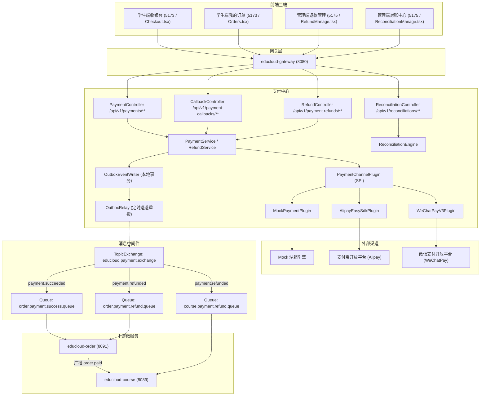

# M08 educloud-payment 支付中心与多渠道收银台设计规格书

> 日期：2026-08-25  
> 状态：已批准（通过头脑风暴流程）  
> 适用服务：`educloud-payment`、`educloud-gateway`、`educloud-order`、`educloud-course`、`student-portal`、`admin-portal`  

---

## 1. 背景与业务目标

在 EduCloud 微服务架构中，M07（订单中心与交易履约）已完成购物车、提单、防重 Token、15 分钟失效关单及基础开课联动。**M08 支付中心（`educloud-payment`）** 承接真实的交易支付、渠道对接、异步回调验签、退款与日终对账能力。

### 核心建设目标：
1. **多渠道统一收银台与 SPI 插件体系**：抽象统一支付通道 SPI（`PaymentChannelPlugin`），支持 Mock 沙箱（本地与 CI/CD 100% 自闭环）、支付宝（Alipay EasySDK 扫码/PC 网页 + RSA2 验签）与微信支付（WeChatPay V3 Native 扫码 + 平台证书验签 + AEAD 解密）。
2. **严格 CAS 状态机与幂等防重**：支付单与退款单全流程采用 CAS 状态流转与版本控制，回调入口采用 Redis 排他锁 + DB 幂等流水双重防重放。
3. **Transactional Outbox 可靠事件总线**：支付成功与退款成功采用本地事务发件箱模式，通过 Outbox Relay 广播至 RabbitMQ，驱动订单中心更新状态及课程中心权限顺/逆向开销。
4. **日终对账与 4 类差错平账中心**：支持定时与手动触发日终双向对账批次，自动识别【本地多记、本地漏记、金额不符、状态不符】4 类差错，管理端提供人工补单、冲正、调账闭环。
5. **三端集成**：学生端收银台升级多渠道支付与轮询结果，管理端新增退款审核与对账中心页面。

---

## 2. 领域架构与服务边界



### 微服务端口规范：
- `educloud-gateway`：`8080`（业务） / `8081`（监控）
- `educloud-payment` (M08)：`8093`（业务） / `8094`（监控）
- `educloud-order`：`8091`（业务） / `8092`（监控）
- `educloud-course`：`8089`（业务） / `8090`（监控）

---

## 3. 数据库与数据设计（MySQL `educloud_payment` 逻辑库）

统一采用 64 位雪花算法主键 ID（`BIGINT UNSIGNED`），时间采用 `DATETIME(3)`，乐观锁采用 `version INT NOT NULL DEFAULT 0`，金额统一使用分（`BIGINT UNSIGNED` / `amount_cents`）。

### 3.1 `payment_order`（支付主单表）
```sql
CREATE TABLE IF NOT EXISTS `payment_order` (
    `id` BIGINT UNSIGNED NOT NULL COMMENT '支付单号(雪花ID)',
    `order_id` BIGINT UNSIGNED NOT NULL COMMENT '业务订单ID(关联educloud-order)',
    `user_id` BIGINT UNSIGNED NOT NULL COMMENT '付款学员ID',
    `amount_cents` BIGINT UNSIGNED NOT NULL COMMENT '应付金额(单位:分)',
    `currency` VARCHAR(16) NOT NULL DEFAULT 'CNY' COMMENT '币种',
    `channel_code` VARCHAR(32) NOT NULL COMMENT '支付渠道(MOCK, ALIPAY, WECHAT)',
    `trade_type` VARCHAR(32) NOT NULL DEFAULT 'NATIVE' COMMENT '交易类型(NATIVE, PAGE, APP)',
    `status` VARCHAR(32) NOT NULL DEFAULT 'INITIATED' COMMENT '状态(INITIATED, PAYING, SUCCESS, FAILED, CLOSED)',
    `channel_trade_no` VARCHAR(128) NULL COMMENT '外部第三方渠道交易流水号',
    `pay_url` VARCHAR(1024) NULL COMMENT '收银台跳转URL或表单',
    `qr_code` TEXT NULL COMMENT '扫码支付二维码内容或Base64',
    `expires_at` DATETIME(3) NOT NULL COMMENT '支付有效截止时间',
    `paid_at` DATETIME(3) NULL COMMENT '支付成功时间',
    `version` INT NOT NULL DEFAULT 0 COMMENT '乐观锁版本号',
    `deleted` TINYINT NOT NULL DEFAULT 0 COMMENT '逻辑删除',
    `created_at` DATETIME(3) NOT NULL DEFAULT CURRENT_TIMESTAMP(3),
    `updated_at` DATETIME(3) NOT NULL DEFAULT CURRENT_TIMESTAMP(3) ON UPDATE CURRENT_TIMESTAMP(3),
    PRIMARY KEY (`id`),
    UNIQUE KEY `uk_order_id_status` (`order_id`, `deleted`),
    KEY `idx_user_status` (`user_id`, `status`),
    KEY `idx_channel_trade_no` (`channel_trade_no`)
) ENGINE=InnoDB DEFAULT CHARSET=utf8mb4 COLLATE=utf8mb4_unicode_ci COMMENT='支付主单表';
```

### 3.2 `payment_transaction`（支付通信流水表）
```sql
CREATE TABLE IF NOT EXISTS `payment_transaction` (
    `id` BIGINT UNSIGNED NOT NULL COMMENT '流水ID(雪花ID)',
    `payment_order_id` BIGINT UNSIGNED NOT NULL COMMENT '支付单ID',
    `transaction_no` VARCHAR(64) NOT NULL COMMENT '商户交易流水号',
    `channel_code` VARCHAR(32) NOT NULL COMMENT '支付渠道',
    `action_type` VARCHAR(32) NOT NULL DEFAULT 'PAY' COMMENT '动作类型(PAY, QUERY, CLOSE, REFUND)',
    `amount_cents` BIGINT UNSIGNED NOT NULL COMMENT '涉及金额(分)',
    `fee_cents` BIGINT UNSIGNED NOT NULL DEFAULT 0 COMMENT '渠道手续费(分)',
    `raw_request` MEDIUMTEXT NULL COMMENT '向渠道发送的原始请求报文',
    `raw_response` MEDIUMTEXT NULL COMMENT '渠道返回的原始响应报文',
    `status` VARCHAR(32) NOT NULL COMMENT '通信状态(SUCCESS, FAILED, UNKNOWN)',
    `created_at` DATETIME(3) NOT NULL DEFAULT CURRENT_TIMESTAMP(3),
    PRIMARY KEY (`id`),
    KEY `idx_payment_order_id` (`payment_order_id`),
    KEY `idx_transaction_no` (`transaction_no`)
) ENGINE=InnoDB DEFAULT CHARSET=utf8mb4 COLLATE=utf8mb4_unicode_ci COMMENT='支付通信流水表';
```

### 3.3 `payment_callback_log`（回调防重与审计表）
```sql
CREATE TABLE IF NOT EXISTS `payment_callback_log` (
    `id` BIGINT UNSIGNED NOT NULL COMMENT '日志ID(雪花ID)',
    `channel_code` VARCHAR(32) NOT NULL COMMENT '支付渠道',
    `notify_id` VARCHAR(128) NOT NULL COMMENT '渠道通知ID或商户单号',
    `request_hash` VARCHAR(64) NOT NULL COMMENT '请求内容SHA256哈希',
    `raw_payload` MEDIUMTEXT NOT NULL COMMENT '原始回调完整请求体',
    `verify_result` VARCHAR(32) NOT NULL COMMENT '验签结果(PASSED, FAILED)',
    `processed_status` VARCHAR(32) NOT NULL COMMENT '处理状态(PROCESSED, DUPLICATED, IGNORED, ERROR)',
    `error_msg` VARCHAR(512) NULL COMMENT '异常错误信息',
    `created_at` DATETIME(3) NOT NULL DEFAULT CURRENT_TIMESTAMP(3),
    PRIMARY KEY (`id`),
    UNIQUE KEY `uk_channel_notify` (`channel_code`, `notify_id`),
    KEY `idx_request_hash` (`request_hash`)
) ENGINE=InnoDB DEFAULT CHARSET=utf8mb4 COLLATE=utf8mb4_unicode_ci COMMENT='回调防重与审计表';
```

### 3.4 `payment_refund`（支付退款单表）
```sql
CREATE TABLE IF NOT EXISTS `payment_refund` (
    `id` BIGINT UNSIGNED NOT NULL COMMENT '退款单ID(雪花ID)',
    `payment_order_id` BIGINT UNSIGNED NOT NULL COMMENT '原支付单ID',
    `order_id` BIGINT UNSIGNED NOT NULL COMMENT '关联业务订单ID',
    `refund_request_id` BIGINT UNSIGNED NULL COMMENT '关联order模块refund_request_id',
    `refund_amount_cents` BIGINT UNSIGNED NOT NULL COMMENT '退款金额(分)',
    `currency` VARCHAR(16) NOT NULL DEFAULT 'CNY' COMMENT '币种',
    `reason` VARCHAR(256) NOT NULL COMMENT '退款原因',
    `channel_code` VARCHAR(32) NOT NULL COMMENT '原支付渠道',
    `channel_refund_no` VARCHAR(128) NULL COMMENT '渠道退款流水号',
    `status` VARCHAR(32) NOT NULL DEFAULT 'APPLIED' COMMENT '状态(APPLIED, PROCESSING, SUCCESS, FAILED, REJECTED)',
    `audited_by` BIGINT UNSIGNED NULL COMMENT '审核人ID',
    `audited_at` DATETIME(3) NULL COMMENT '审核时间',
    `audit_remark` VARCHAR(512) NULL COMMENT '审核备注',
    `refunded_at` DATETIME(3) NULL COMMENT '退款到账时间',
    `version` INT NOT NULL DEFAULT 0 COMMENT '乐观锁版本号',
    `created_at` DATETIME(3) NOT NULL DEFAULT CURRENT_TIMESTAMP(3),
    `updated_at` DATETIME(3) NOT NULL DEFAULT CURRENT_TIMESTAMP(3) ON UPDATE CURRENT_TIMESTAMP(3),
    PRIMARY KEY (`id`),
    KEY `idx_payment_order_id` (`payment_order_id`),
    KEY `idx_order_id` (`order_id`),
    KEY `idx_status` (`status`)
) ENGINE=InnoDB DEFAULT CHARSET=utf8mb4 COLLATE=utf8mb4_unicode_ci COMMENT='支付退款单表';
```

### 3.5 `reconciliation_batch`（日终对账批次表）
```sql
CREATE TABLE IF NOT EXISTS `reconciliation_batch` (
    `id` BIGINT UNSIGNED NOT NULL COMMENT '批次ID(雪花ID)',
    `batch_no` VARCHAR(64) NOT NULL COMMENT '对账批次号(如 REC_20260825_MOCK)',
    `reconcile_date` DATE NOT NULL COMMENT '对账账单日期',
    `channel_code` VARCHAR(32) NOT NULL COMMENT '对账渠道',
    `total_count` INT NOT NULL DEFAULT 0 COMMENT '比对交易总笔数',
    `total_amount_cents` BIGINT UNSIGNED NOT NULL DEFAULT 0 COMMENT '比对交易总金额(分)',
    `diff_count` INT NOT NULL DEFAULT 0 COMMENT '差异差错笔数',
    `status` VARCHAR(32) NOT NULL DEFAULT 'RUNNING' COMMENT '批次状态(RUNNING, MATCHED, DIFF_FOUND, RESOLVED)',
    `started_at` DATETIME(3) NOT NULL DEFAULT CURRENT_TIMESTAMP(3),
    `finished_at` DATETIME(3) NULL,
    PRIMARY KEY (`id`),
    UNIQUE KEY `uk_date_channel` (`reconcile_date`, `channel_code`)
) ENGINE=InnoDB DEFAULT CHARSET=utf8mb4 COLLATE=utf8mb4_unicode_ci COMMENT='日终对账批次表';
```

### 3.6 `reconciliation_diff`（对账差错单表）
```sql
CREATE TABLE IF NOT EXISTS `reconciliation_diff` (
    `id` BIGINT UNSIGNED NOT NULL COMMENT '差错单ID(雪花ID)',
    `batch_id` BIGINT UNSIGNED NOT NULL COMMENT '关联对账批次ID',
    `diff_type` VARCHAR(32) NOT NULL COMMENT '差错类型(LOCAL_MORE, CHANNEL_MORE, AMOUNT_MISMATCH, STATUS_MISMATCH)',
    `payment_order_id` BIGINT UNSIGNED NULL COMMENT '本地支付单ID',
    `channel_trade_no` VARCHAR(128) NULL COMMENT '渠道交易号',
    `local_amount_cents` BIGINT UNSIGNED NULL COMMENT '本地金额(分)',
    `channel_amount_cents` BIGINT UNSIGNED NULL COMMENT '渠道金额(分)',
    `local_status` VARCHAR(32) NULL COMMENT '本地状态',
    `channel_status` VARCHAR(32) NULL COMMENT '渠道状态',
    `resolve_status` VARCHAR(32) NOT NULL DEFAULT 'UNRESOLVED' COMMENT '平账状态(UNRESOLVED, RESOLVED, IGNORED)',
    `resolve_action` VARCHAR(32) NULL COMMENT '处理动作(MANUAL_REPAIR, REFUND_OFFLINE, ADJUST_AMOUNT, MANUAL_SYNC, IGNORE)',
    `resolve_remark` VARCHAR(512) NULL COMMENT '平账处理备注',
    `resolved_by` BIGINT UNSIGNED NULL COMMENT '平账操作人ID',
    `resolved_at` DATETIME(3) NULL,
    `created_at` DATETIME(3) NOT NULL DEFAULT CURRENT_TIMESTAMP(3),
    PRIMARY KEY (`id`),
    KEY `idx_batch_id` (`batch_id`),
    KEY `idx_resolve_status` (`resolve_status`)
) ENGINE=InnoDB DEFAULT CHARSET=utf8mb4 COLLATE=utf8mb4_unicode_ci COMMENT='对账差错单表';
```

### 3.7 `payment_outbox_event`（事务发件箱表）
```sql
CREATE TABLE IF NOT EXISTS `payment_outbox_event` (
    `id` BIGINT UNSIGNED NOT NULL COMMENT '事件ID(雪花ID)',
    `aggregate_type` VARCHAR(32) NOT NULL COMMENT '聚合根类型(PAYMENT, REFUND)',
    `aggregate_id` BIGINT UNSIGNED NOT NULL COMMENT '聚合根ID',
    `event_type` VARCHAR(64) NOT NULL COMMENT '事件类型(PaymentSucceededEvent, PaymentRefundedEvent)',
    `payload` JSON NOT NULL COMMENT '事件序列化JSON内容',
    `status` VARCHAR(32) NOT NULL DEFAULT 'PENDING' COMMENT '状态(PENDING, SENDING, PUBLISHED, FAILED)',
    `retry_count` INT NOT NULL DEFAULT 0 COMMENT '重试次数',
    `next_retry_time` DATETIME(3) NOT NULL DEFAULT CURRENT_TIMESTAMP(3) COMMENT '下次重试时间',
    `published_at` DATETIME(3) NULL,
    `created_at` DATETIME(3) NOT NULL DEFAULT CURRENT_TIMESTAMP(3),
    PRIMARY KEY (`id`),
    KEY `idx_status_retry` (`status`, `next_retry_time`)
) ENGINE=InnoDB DEFAULT CHARSET=utf8mb4 COLLATE=utf8mb4_unicode_ci COMMENT='支付中心事务发件箱';
```

---

## 4. 状态机与核心业务流转

### 4.1 支付主单状态机（CAS 条件控制）
- `INITIATED`（初始化）➔ `PAYING`（收银台出码/跳转已生成）
- `INITIATED` / `PAYING` ➔ `SUCCESS`：
  - **CAS 条件**：`WHERE id = ? AND status IN ('INITIATED', 'PAYING') AND expires_at > NOW()`
  - 在同一 DB 本地事务中：更新状态为 `SUCCESS`、记录 `paid_at = NOW()`、记录 `channel_trade_no`、写入 `payment_outbox_event`。
- `INITIATED` / `PAYING` ➔ `CLOSED`：
  - 15 分钟失效关单或主动撤销：`WHERE id = ? AND status IN ('INITIATED', 'PAYING')`
- `INITIATED` / `PAYING` ➔ `FAILED`：渠道拒绝支付。

### 4.2 退款单状态机
- `APPLIED`（已申请）➔ `PROCESSING`（审核通过，发起渠道退款）➔ `SUCCESS`（原路退款成功，写入 Outbox 发送 `PaymentRefundedEvent`）
- `APPLIED` ➔ `REJECTED`（财务审核驳回）
- `PROCESSING` ➔ `FAILED`（渠道退款异常，支持重试）

---

## 5. 统一支付 SPI 插件体系（`PaymentChannelPlugin`）

### 5.1 SPI 接口契约
```java
public interface PaymentChannelPlugin {
    PaymentChannel getChannel();
    UnifiedPayResult initiatePayment(PaymentContext ctx);
    CallbackVerifyResult verifyAndParseCallback(HttpServletRequest req, String rawBody);
    UnifiedRefundResult initiateRefund(RefundContext ctx);
    UnifiedQueryResult queryPayment(String channelTradeNo, String paymentOrderId);
    List<ChannelBillItem> downloadBill(LocalDate date);
}
```

### 5.2 插件实现规范
1. **`MockPaymentPlugin`**：
   - 专用于本地开发、VM 运行、E2E 测试与 Playwright 自动化。
   - `initiatePayment`：生成 Mock 收银台链接与虚拟二维码。
   - `mockConfirm`：支持前端一键模拟支付成功/失败。
   - `downloadBill`：自动提取当日 Mock 渠道流水生成标准对账单，支持注入测试差错数据进行平账验证。
2. **`AlipayEasySdkPlugin`**：
   - 基于 Alipay EasySDK / 开放平台标准协议。
   - `initiatePayment`：调用 `Factory.Payment.Page().pay(...)` 或 `Factory.Payment.FaceToFace().preCreate(...)` 生成 PC 支付跳转 URL 或二维码。
   - `verifyAndParseCallback`：提取 `POST` 表单全部参数，调用 `Factory.Payment.Common().verifyNotify(params)` 基于 RSA2 支付宝公钥进行严格验签。
3. **`WeChatPayV3Plugin`**：
   - 基于微信支付 APIv3 标准协议。
   - `initiatePayment`：调用 Native 统一下单接口生成 `code_url`。
   - `verifyAndParseCallback`：校验 HTTP 请求头中的 `Wechatpay-Timestamp`、`Wechatpay-Nonce`、`Wechatpay-Signature`、`Wechatpay-Serial`（基于微信平台公钥证书 SHA256withRSA 验签）；验签通过后，使用 APIv3 Key 基于 `AesGcm` 对 `resource.ciphertext` 密文进行解密得到真实支付通知明文。

---

## 6. 异步回调安全与防重放机制

### 6.1 网关与安全配置
- 网关路由放行：`/api/v1/payment-callbacks/**` 允许匿名访问，但严密防护内部伪造。
- 内部防护机制：
  1. **Redis 分布式锁**：`SET educloud:payment:callback:lock:{channel}:{notifyId} 1 NX EX 60`。若获取锁失败（并发重复推送），直接幂等返回渠道成功响应。
  2. **DB 幂等记录**：在 `payment_callback_log` 表插入防重记录。若已存在且处理状态为 `PROCESSED`，直接应答成功。
  3. **渠道严格验签**：若验签失败，记录 `verify_result = 'FAILED'`，抛出 `PAYMENT_CALLBACK_SIGN_INVALID` 且不变更任何业务状态。
  4. **金额与商户校验**：校验渠道返回的 `total_amount` 与本地 `payment_order.amount_cents` 严格一致，防止金额篡改。

---

## 7. Transactional Outbox 可靠事件投递与微服务协作

### 7.1 RabbitMQ 交换机与队列配置
- **TopicExchange**：`educloud.payment.exchange`
- **队列绑定**：
  - `order.payment.success.queue`（绑定 RoutingKey `payment.succeeded`）➔ 由 `educloud-order` 消费
  - `order.payment.refund.queue`（绑定 RoutingKey `payment.refunded`）➔ 由 `educloud-order` 消费
  - `course.payment.refund.queue`（绑定 RoutingKey `payment.refunded`）➔ 由 `educloud-course` 消费

### 7.2 事件定义与消费行为
1. **`PaymentSucceededEvent`**：
   - Payload：
     ```json
     {
       "paymentOrderId": "2091998812345678901",
       "orderId": "2091895618182258690",
       "userId": "2091648316809035778",
       "amountCents": 19900,
       "channelCode": "MOCK",
       "channelTradeNo": "MOCK_TR_202608250001",
       "paidAt": "2026-08-25T12:00:00.000Z"
     }
     ```
   - **`educloud-order` 消费处理**：CAS 更新订单状态为 `PAID`、`paid_at = paidAt`，保存支付渠道流水，随后广播 `OrderPaidEvent` 触发课程中心开课。
2. **`PaymentRefundedEvent`**：
   - Payload：
     ```json
     {
       "refundId": "2091999912345678902",
       "paymentOrderId": "2091998812345678901",
       "orderId": "2091895618182258690",
       "userId": "2091648316809035778",
       "refundAmountCents": 19900,
       "refundedAt": "2026-08-25T12:30:00.000Z"
     }
     ```
   - **`educloud-order` 消费处理**：CAS 更新订单状态为 `REFUNDED`，更新退款单状态为 `SUCCESS`。
   - **`educloud-course` 消费处理**：将该学员对应课程的选课记录（`course_enrollment`）状态置为 `REVOKED`，关闭学习与播放权限。

### 7.3 Outbox Relay 机制
- `PaymentOutboxRelay` 采用定时任务调度（每 1 秒），执行：
  ```sql
  UPDATE payment_outbox_event 
  SET status = 'SENDING' 
  WHERE status = 'PENDING' AND next_retry_time <= NOW() 
  LIMIT 50;
  ```
- 投递成功后更新状态为 `PUBLISHED`，投递失败采用指数退避（1s, 2s, 4s, 8s... 最多 5 次），超限标记 `FAILED`。

---

## 8. 日终对账中心与差错平账引擎

### 8.1 对账流程
1. **触发方式**：
   - 定时触发：每日 02:00 对账前一日数据；
   - 手动触发：`POST /api/v1/reconciliations/trigger?date=YYYY-MM-DD&channel=MOCK`。
2. **双向比对算法**：
   - 提取渠道日终对账单（SPI `downloadBill`）与本地交易/退款流水；
   - 按 `(channel_trade_no, order_id)` 进行哈希聚合与全外连接（Full Outer Join）；
   - 分类识别出 4 类差错并入库 `reconciliation_diff`。
3. **人工平账与处理动作（`resolve_action`）**：
   - `MANUAL_REPAIR`（自动补单）：补录支付单并通过 Outbox 补发 `PaymentSucceededEvent` 驱动开课。
   - `REFUND_OFFLINE`（退款冲正）：标记异常流水并冻结权益。
   - `ADJUST_AMOUNT`（调账）：记录调账金额与经办人备注。
   - `MANUAL_SYNC`（同步渠道）：以渠道实际终态覆盖本地状态。
   - `IGNORE`（忽略/平账）：填写备注并归档。

---

## 9. REST API 端点清单与契约

| 端/角色 | 端点路径 | Method | 权限/鉴权 | 描述 |
|---|---|---|---|---|
| 学生 | `/api/v1/payments/cashier` | POST | Bearer Token | 提交订单发起收银台支付（获取二维码/跳转URL/Mock标识） |
| 学生 | `/api/v1/payments/{id}` | GET | Bearer Token | 轮询查询支付单状态与支付凭证 |
| 学生 | `/api/v1/payments/{id}/mock-confirm` | POST | Bearer Token | （仅开发环境）手动触发 Mock 支付成功确认 |
| 公共 | `/api/v1/payment-callbacks/{channel}` | POST | 匿名放行(验签) | 支付宝/微信等渠道异步 Webhook 回调接收入口 |
| 学生 | `/api/v1/payment-refunds/apply` | POST | Bearer Token | 学员针对已支付订单申请退款 |
| 管理 | `/api/v1/payment-refunds` | GET | `refund:admin` | 分页查询全量退款单流水列表 |
| 管理 | `/api/v1/payment-refunds/{id}/audit` | POST | `refund:admin` | 财务审核退款申请（通过即调用渠道原路退款） |
| 管理 | `/api/v1/reconciliations/trigger` | POST | `reconciliation:admin` | 手动触发指定日期与渠道对账批次 |
| 管理 | `/api/v1/reconciliations/batches` | GET | `reconciliation:admin` | 分页查询对账批次列表 |
| 管理 | `/api/v1/reconciliations/diffs` | GET | `reconciliation:admin` | 分页查询对账差错单明细 |
| 管理 | `/api/v1/reconciliations/diffs/{id}/resolve` | POST | `reconciliation:admin` | 执行差错平账处理 |
| 内部 | `/internal/v1/orders/{id}/payable-snapshot` | GET | Service Secret | 内部 RPC（调用 order 服务查验可付性与金额） |

---

## 10. 前端三端页面与交互设计

1. **学生端收银台（`student-portal` : 5173 / `Checkout.tsx`）**：
   - 渠道选择卡片：Mock 模拟支付（推荐测试）、支付宝扫码支付、微信扫码支付；
   - 支付宝/微信交互：展示动态生成的支付二维码弹窗，内置 3 秒心跳轮询 `GET /api/v1/payments/{id}`；
   - 支付成功态：渲染高质感绿色完成态面板，展示“支付成功、订单号、实付金额”，提供“立即学习”按钮直接跳转 `Learning.tsx`。
2. **学生端订单中心（`student-portal` : 5173 / `Orders.tsx`）**：
   - 在已支付订单项上提供“申请退款”按钮与弹窗输入退款原因。
3. **管理端退款中心（`admin-portal` : 5175 / `RefundManage.tsx`）**：
   - 退款单列表：展示退款单号、原订单号、学员姓名、退款金额、申请原因、审核状态；
   - 审核弹窗：提供“通过并原路退款”、“驳回”及审核备注输入。
4. **管理端对账中心（`admin-portal` : 5175 / `ReconciliationManage.tsx`）**：
   - 顶部对账看板：展示今日对账状态、总笔数、总金额、差错笔数，提供“一键发起对账”按钮；
   - 差错单管理列表：展示 4 类差错单，单行提供“平账处置”弹窗（补单/调账/冲正/忽略）。

---

## 11. 质量门禁与测试验收计划

严格遵循 `docs/superpowers/specs/2026-08-20-educloud-backend-module-execution.md` 规定的通用必选门禁：
1. **失败测试先行（TDD 模式）**：
   - `PaymentServiceTest`：覆盖支付单创建、金额防篡改校验、CAS 状态流转；
   - `ChannelPluginTest`：覆盖 Mock 模拟、Alipay EasySDK 验签、WeChatPay V3 证书验签与 AEAD 解密；
   - `RefundServiceTest`：覆盖退款申请、财务审核、渠道原路退款；
   - `ReconciliationEngineTest`：覆盖 4 类差错识别与人工平账逻辑；
   - `OutboxRelayTest`：覆盖发件箱扫描、并发抢占与指数退避重投。
2. **E2E 全链路集成测试（`scratch/test_payment_e2e.py`）**：
   - 覆盖【登录 ➔ 课程加购 ➔ 下单 ➔ 收银台选 Mock 支付 ➔ 支付确认 ➔ Outbox 广播 ➔ 订单状态置 PAID ➔ 课程自动开通 ➔ 申请退款 ➔ 财务审核原路退款 ➔ 订单状态置 REFUNDED ➔ 选课权限置 REVOKED ➔ 触发对账 ➔ 差错识别与平账处置】全流程 100% 自动断言。
3. **Playwright 浏览器 UI 实测与截图留存**：
   - 学生端收银台多渠道切换与支付、管理端退款审核、管理端对账与差错平账实测截图。

---

## 12. 避坑指南与开发规范

1. **Snowflake ID 字符串化**：所有返回前端的雪花 ID 字段必须声明为字符串，后端实体字段统一标注 `@JsonSerialize(using = ToStringSerializer.class)`。
2. **统一 API Result 信封**：所有后端接口返回格式必须为 `{ code: "SUCCESS", message: "OK", data: T, traceId: "..." }`。
3. **JDBC URL 字符集**：MySQL 连接串必须写 `characterEncoding=utf8`（Java 规范），严禁写 `utf8mb4`。
4. **Spring Cloud LoadBalancer 依赖**：POM 中必须显式引入 `spring-cloud-starter-loadbalancer` 以支持 FeignClient 服务名调用。
5. **fail-closed 安全策略**：未配置渠道密钥、回调验签失败、金额不一致或环境门控缺失时，系统一律 fail-closed 阻断交易。
