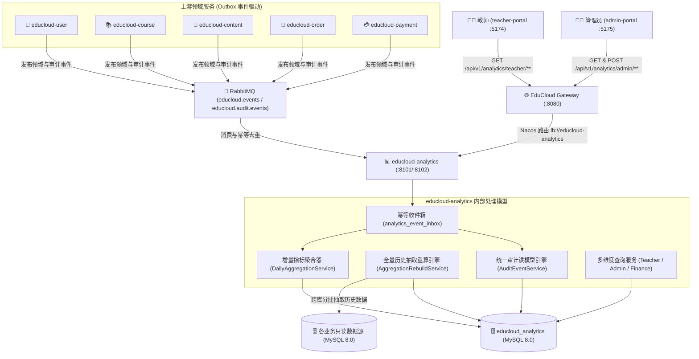
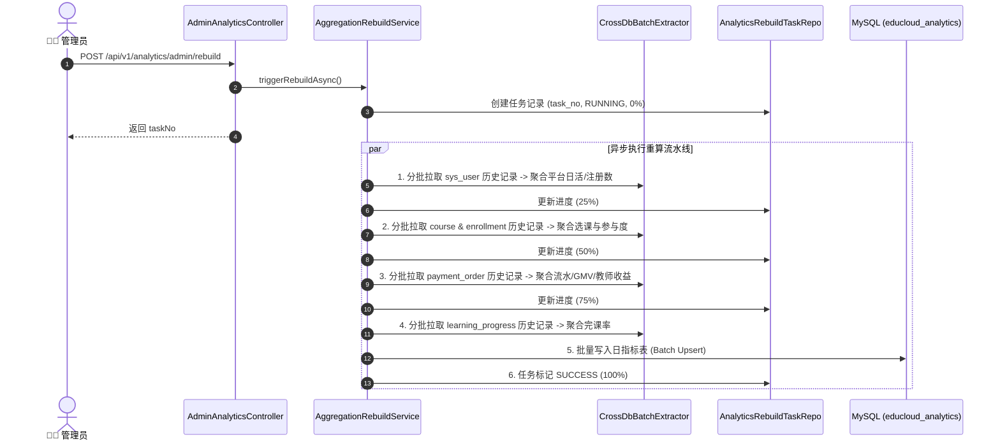

# EduCloud M12 学习分析与指标大屏中心（`educloud-analytics`）技术设计规约

- **作者**：EduCloud 架构团队
- **状态**：已评审 (Approved)
- **创建日期**：2026-08-26
- **目标版本**：EduCloud v1.0.0-M12

---

## 1. 架构定位与系统拓扑

`educloud-analytics` 是 EduCloud 微服务架构中的核心数据智能与分析中心，负责汇聚全平台各微服务的业务事实与操作审计事件，通过预聚合日统计模型与可回溯的全量抽取引擎，为教师端教学分析大屏、管理端平台运营大屏、财务营收大屏以及全平台安全审计日志提供高可用、毫秒级响应的真实数据源。

### 1.1 服务拓扑



### 1.2 端口与网络规划
- **服务端口**：`8101`（HTTP API / MVC）
- **管理端口**：`8102`（Actuator 探针 / Prometheus 指标收集）
- **数据库**：`educloud_analytics`（MySQL 8.0，逻辑库独立，账号 `analytics_app`）
- **网关路由映射**：
  - `/api/v1/analytics/**` $\to$ `lb://educloud-analytics`
  - 内部服务鉴权：`InternalApiFilter` 校验 `X-Internal-Token` 与 `X-User-Id`

---

## 2. 数据库与持久化模型设计

### 2.1 技术表迁移（`V000__technical_tables.sql`）
包含标准化幂等与水位控制表：
- `analytics_event_inbox`：幂等防重收件箱
- `consumer_watermark`：来源服务事件消费水位记录

### 2.2 业务表结构定义（`V001__metrics_and_audit_views.sql`）

```sql
-- 1. 教师日度统计指标表
CREATE TABLE IF NOT EXISTS `daily_teacher_metrics` (
    `id` BIGINT NOT NULL AUTO_INCREMENT COMMENT '主键ID',
    `teacher_id` VARCHAR(64) NOT NULL COMMENT '教师用户ID',
    `metric_date` DATE NOT NULL COMMENT '统计日期 (YYYY-MM-DD)',
    `new_enrollments` INT NOT NULL DEFAULT 0 COMMENT '当日新增选课人数',
    `revenue_cents` BIGINT NOT NULL DEFAULT 0 COMMENT '当日归属营收(分)',
    `active_students` INT NOT NULL DEFAULT 0 COMMENT '当日活跃学员数',
    `completed_courses_count` INT NOT NULL DEFAULT 0 COMMENT '当日完课人次',
    `created_at` DATETIME NOT NULL DEFAULT CURRENT_TIMESTAMP,
    `updated_at` DATETIME NOT NULL DEFAULT CURRENT_TIMESTAMP ON UPDATE CURRENT_TIMESTAMP,
    PRIMARY KEY (`id`),
    UNIQUE KEY `uk_teacher_date` (`teacher_id`, `metric_date`),
    KEY `idx_teacher_date_range` (`teacher_id`, `metric_date` DESC)
) ENGINE=InnoDB DEFAULT CHARSET=utf8mb4 COLLATE=utf8mb4_unicode_ci COMMENT='教师日度统计预聚合表';

-- 2. 平台运营日度统计指标表
CREATE TABLE IF NOT EXISTS `daily_platform_metrics` (
    `id` BIGINT NOT NULL AUTO_INCREMENT COMMENT '主键ID',
    `metric_date` DATE NOT NULL COMMENT '统计日期 (YYYY-MM-DD)',
    `total_users` INT NOT NULL DEFAULT 0 COMMENT '累计用户总数',
    `new_users` INT NOT NULL DEFAULT 0 COMMENT '当日新增注册用户数',
    `total_courses` INT NOT NULL DEFAULT 0 COMMENT '累计已发布课程数',
    `new_courses` INT NOT NULL DEFAULT 0 COMMENT '当日新增发布课程数',
    `total_orders` INT NOT NULL DEFAULT 0 COMMENT '当日成功支付订单数',
    `gmv_cents` BIGINT NOT NULL DEFAULT 0 COMMENT '当日GMV总流水(分)',
    `refund_cents` BIGINT NOT NULL DEFAULT 0 COMMENT '当日退款金额(分)',
    `created_at` DATETIME NOT NULL DEFAULT CURRENT_TIMESTAMP,
    `updated_at` DATETIME NOT NULL DEFAULT CURRENT_TIMESTAMP ON UPDATE CURRENT_TIMESTAMP,
    PRIMARY KEY (`id`),
    UNIQUE KEY `uk_platform_date` (`metric_date`)
) ENGINE=InnoDB DEFAULT CHARSET=utf8mb4 COLLATE=utf8mb4_unicode_ci COMMENT='平台运营日度统计表';

-- 3. 平台财务日度统计指标表
CREATE TABLE IF NOT EXISTS `daily_finance_metrics` (
    `id` BIGINT NOT NULL AUTO_INCREMENT COMMENT '主键ID',
    `metric_date` DATE NOT NULL COMMENT '统计日期 (YYYY-MM-DD)',
    `gross_revenue_cents` BIGINT NOT NULL DEFAULT 0 COMMENT '当日总流水(分)',
    `refund_amount_cents` BIGINT NOT NULL DEFAULT 0 COMMENT '当日退款金额(分)',
    `net_revenue_cents` BIGINT NOT NULL DEFAULT 0 COMMENT '当日净营收(分)',
    `order_count` INT NOT NULL DEFAULT 0 COMMENT '当日支付订单笔数',
    `refund_count` INT NOT NULL DEFAULT 0 COMMENT '当日退款笔数',
    `created_at` DATETIME NOT NULL DEFAULT CURRENT_TIMESTAMP,
    `updated_at` DATETIME NOT NULL DEFAULT CURRENT_TIMESTAMP ON UPDATE CURRENT_TIMESTAMP,
    PRIMARY KEY (`id`),
    UNIQUE KEY `uk_finance_date` (`metric_date`)
) ENGINE=InnoDB DEFAULT CHARSET=utf8mb4 COLLATE=utf8mb4_unicode_ci COMMENT='财务日度统计表';

-- 4. 课程参与度与完课率快照表
CREATE TABLE IF NOT EXISTS `course_engagement_stats` (
    `id` BIGINT NOT NULL AUTO_INCREMENT COMMENT '主键ID',
    `course_id` VARCHAR(64) NOT NULL COMMENT '课程ID',
    `teacher_id` VARCHAR(64) NOT NULL COMMENT '授课教师ID',
    `course_title` VARCHAR(255) NOT NULL DEFAULT '' COMMENT '课程标题',
    `total_enrolled` INT NOT NULL DEFAULT 0 COMMENT '累计报名学员数',
    `avg_progress_percent` DECIMAL(5,2) NOT NULL DEFAULT 0.00 COMMENT '平均学习进度(%)',
    `completion_count` INT NOT NULL DEFAULT 0 COMMENT '完课学员数',
    `completion_rate` DECIMAL(5,2) NOT NULL DEFAULT 0.00 COMMENT '完课率(%)',
    `created_at` DATETIME NOT NULL DEFAULT CURRENT_TIMESTAMP,
    `updated_at` DATETIME NOT NULL DEFAULT CURRENT_TIMESTAMP ON UPDATE CURRENT_TIMESTAMP,
    PRIMARY KEY (`id`),
    UNIQUE KEY `uk_course_id` (`course_id`),
    KEY `idx_teacher_engagement` (`teacher_id`, `total_enrolled` DESC)
) ENGINE=InnoDB DEFAULT CHARSET=utf8mb4 COLLATE=utf8mb4_unicode_ci COMMENT='课程学习参与度快照表';

-- 5. 全平台集中式操作审计读模型表
CREATE TABLE IF NOT EXISTS `audit_event_read_model` (
    `id` BIGINT NOT NULL AUTO_INCREMENT COMMENT '自增主键',
    `event_id` VARCHAR(64) NOT NULL COMMENT '事件全局唯一ID',
    `service_name` VARCHAR(64) NOT NULL COMMENT '来源服务',
    `operator_id` VARCHAR(64) NOT NULL COMMENT '操作人ID',
    `operator_name` VARCHAR(128) NOT NULL DEFAULT '' COMMENT '操作人账号/姓名',
    `action_type` VARCHAR(64) NOT NULL COMMENT '操作动作类型(LOGIN/COURSE_AUDIT/PAY/REBUILD等)',
    `target_type` VARCHAR(64) NOT NULL DEFAULT '' COMMENT '目标资源类型',
    `target_id` VARCHAR(64) NOT NULL DEFAULT '' COMMENT '目标资源ID',
    `ip_address` VARCHAR(64) NOT NULL DEFAULT '' COMMENT '客户端IP',
    `log_level` VARCHAR(16) NOT NULL DEFAULT 'INFO' COMMENT '日志级别(INFO/WARN/ERROR)',
    `details_json` TEXT COMMENT '事件上下文Payload(JSON)',
    `created_at` DATETIME NOT NULL COMMENT '操作发生时间',
    PRIMARY KEY (`id`),
    UNIQUE KEY `uk_audit_event_id` (`event_id`),
    KEY `idx_created_at` (`created_at` DESC),
    KEY `idx_operator` (`operator_id`, `created_at` DESC),
    KEY `idx_action_level` (`action_type`, `log_level`, `created_at` DESC)
) ENGINE=InnoDB DEFAULT CHARSET=utf8mb4 COLLATE=utf8mb4_unicode_ci COMMENT='全平台集中式审计日志读模型表';

-- 6. 全量指标重算任务记录表
CREATE TABLE IF NOT EXISTS `analytics_rebuild_task` (
    `id` BIGINT NOT NULL AUTO_INCREMENT COMMENT '自增主键',
    `task_no` VARCHAR(64) NOT NULL COMMENT '任务唯一编号',
    `status` VARCHAR(32) NOT NULL DEFAULT 'RUNNING' COMMENT '状态(RUNNING/SUCCESS/FAILED)',
    `stage` VARCHAR(64) NOT NULL DEFAULT 'INIT' COMMENT '执行阶段',
    `total_items` INT NOT NULL DEFAULT 0 COMMENT '待处理数据总量',
    `processed_items` INT NOT NULL DEFAULT 0 COMMENT '已处理数据量',
    `error_message` TEXT COMMENT '失败原因详情',
    `started_at` DATETIME NOT NULL DEFAULT CURRENT_TIMESTAMP,
    `finished_at` DATETIME DEFAULT NULL,
    PRIMARY KEY (`id`),
    UNIQUE KEY `uk_task_no` (`task_no`),
    KEY `idx_status_started` (`status`, `started_at` DESC)
) ENGINE=InnoDB DEFAULT CHARSET=utf8mb4 COLLATE=utf8mb4_unicode_ci COMMENT='全量指标重算任务记录表';
```

---

## 3. 消息消费与增量聚合设计

### 3.1 监听队列与路由键绑定

| 队列名称 | 交换机 | 路由键 (Routing Key) | 触发事件类型 | 目标更新模型 |
| :--- | :--- | :--- | :--- | :--- |
| `analytics.user.queue` | `educloud.user.events` | `user.registered`, `user.login` | `UserRegistered`, `UserLoggedIn` | 平台新增用户、审计日志 |
| `analytics.course.queue`| `educloud.course.events` | `course.published`, `enrollment.created` | `CoursePublished`, `EnrollmentCreated` | 平台课程数、教师选课数、课程参与度快照 |
| `analytics.payment.queue`| `educloud.payment.events` | `payment.success`, `refund.completed` | `PaymentSuccess`, `RefundCompleted` | 平台GMV、财务流水、教师营收增减 |
| `analytics.content.queue`| `educloud.content.events` | `progress.updated` | `LearningProgressUpdated` | 课程平均进度、完课率、活跃学员 |
| `analytics.audit.queue` | `educloud.audit.events` | `audit.*` | `AuditEventPublished` | `audit_event_read_model` |

### 3.2 幂等原子聚合算法
针对每日指标累加，统一使用 MySQL 原子 Upsert 语法，防止分布式环境下的并发覆盖问题：
```sql
INSERT INTO daily_teacher_metrics (
    teacher_id, metric_date, new_enrollments, revenue_cents, active_students, completed_courses_count
) VALUES (
    #{teacherId}, #{metricDate}, #{enrollments}, #{revenueCents}, #{activeStudents}, #{completedCount}
) ON DUPLICATE KEY UPDATE
    new_enrollments = new_enrollments + VALUES(new_enrollments),
    revenue_cents = revenue_cents + VALUES(revenue_cents),
    active_students = active_students + VALUES(active_students),
    completed_courses_count = completed_courses_count + VALUES(completed_courses_count),
    updated_at = NOW();
```

---

## 4. 全量历史数据抽取与平滑重算引擎

### 4.1 重算任务执行流程


---

## 5. REST 接口与前后端契约规范

### 5.1 教师端数据接口（`TeacherAnalyticsController`）

#### 1. 教师总体概览（`GET /api/v1/analytics/teacher/stats`）
- **鉴权**：解析请求头 `X-User-Id`
- **响应**：
```json
{
  "code": 200,
  "data": {
    "totalCourses": 12,
    "totalStudents": 3420,
    "totalRevenue": 128500.0,
    "completionRate": 78.5
  },
  "message": "success"
}
```

#### 2. 6 个月报名趋势（`GET /api/v1/analytics/teacher/enrollment-trend`）
- **响应**：
```json
{
  "code": 200,
  "data": [
    { "month": "3月", "count": 280 },
    { "month": "4月", "count": 350 },
    { "month": "5月", "count": 420 },
    { "month": "6月", "count": 390 },
    { "month": "7月", "count": 510 },
    { "month": "8月", "count": 680 }
  ]
}
```

#### 3. 6 个月收入趋势（`GET /api/v1/analytics/teacher/revenue-trend`）
- **响应**：
```json
{
  "code": 200,
  "data": [
    { "month": "3月", "amount": 12500.0 },
    { "month": "4月", "amount": 18200.0 },
    { "month": "5月", "amount": 23400.0 },
    { "month": "6月", "amount": 21000.0 },
    { "month": "7月", "amount": 28900.0 },
    { "month": "8月", "amount": 35600.0 }
  ]
}
```

#### 4. 学员参与度与课程排行（`GET /api/v1/analytics/teacher/engagement`）
- **响应**：
```json
{
  "code": 200,
  "data": [
    { "courseId": "101", "course": "Spring Cloud 微服务架构实战", "students": 1240, "rate": 84.2 },
    { "courseId": "102", "course": "Vue 3 + TypeScript 商业项目实战", "students": 980, "rate": 79.5 }
  ]
}
```

#### 5. 教师动态流（`GET /api/v1/analytics/teacher/activities`）
- **响应**：
```json
{
  "code": 200,
  "data": [
    { "id": "1", "student": "张同学", "action": "完成了章节", "target": "第3章 服务熔断与限流", "time": "10分钟前" },
    { "id": "2", "student": "李同学", "action": "报名了课程", "target": "Spring Cloud 微服务架构实战", "time": "25分钟前" }
  ]
}
```

---

### 5.2 管理端数据看板与财务接口（`AdminAnalyticsController` & `FinanceAnalyticsController`）

#### 1. 管理端核心运营大屏概览（`GET /api/v1/analytics/admin/overview`）
- **权限**：`ROLE_ADMIN`
- **响应**：
```json
{
  "code": 200,
  "data": {
    "totalUsers": 28450,
    "userGrowth": 12.8,
    "totalCourses": 156,
    "courseGrowth": 5.4,
    "totalRevenue": 1584200.0,
    "revenueGrowth": 18.6,
    "activeStreams": 3,
    "streamGrowth": 0.0
  }
}
```

#### 2. 用户与课程增长趋势图（`GET /api/v1/analytics/admin/user-growth`）
- **响应**：
```json
{
  "code": 200,
  "data": [
    { "date": "08-20", "users": 28100, "courses": 150 },
    { "date": "08-21", "users": 28180, "courses": 152 },
    { "date": "08-22", "users": 28260, "courses": 153 },
    { "date": "08-23", "users": 28310, "courses": 154 },
    { "date": "08-24", "users": 28390, "courses": 155 },
    { "date": "08-25", "users": 28450, "courses": 156 }
  ]
}
```

#### 3. 课程分类与订单分布（`GET /api/v1/analytics/admin/distributions`）
- **响应**：
```json
{
  "code": 200,
  "data": {
    "categories": [
      { "name": "后端开发", "value": 45, "percentage": 28.8 },
      { "name": "前端工程", "value": 38, "percentage": 24.4 },
      { "name": "人工智能", "value": 32, "percentage": 20.5 },
      { "name": "云计算与DevOps", "value": 25, "percentage": 16.0 },
      { "name": "其它", "value": 16, "percentage": 10.3 }
    ],
    "orderStatuses": [
      { "status": "COMPLETED", "label": "已完成", "count": 1820, "percentage": 85.0 },
      { "status": "REFUNDED", "label": "已退款", "count": 85, "percentage": 4.0 },
      { "status": "CANCELLED", "label": "已取消", "count": 235, "percentage": 11.0 }
    ]
  }
}
```

#### 4. 财务总览与 12 个月收支对比（`GET /api/v1/analytics/admin/finance/overview`）
- **响应**：
```json
{
  "code": 200,
  "data": {
    "stats": {
      "totalGmv": 1584200.0,
      "pendingSettlement": 45200.0,
      "totalRefund": 32800.0,
      "refundRate": 2.07,
      "avgOrderAmount": 298.5
    },
    "monthly": [
      { "month": "2026-03", "income": 128000.0, "refund": 2400.0, "net": 125600.0 },
      { "month": "2026-04", "income": 145000.0, "refund": 3100.0, "net": 141900.0 },
      { "month": "2026-05", "income": 162000.0, "refund": 2800.0, "net": 159200.0 },
      { "month": "2026-06", "income": 158000.0, "refund": 3500.0, "net": 154500.0 },
      { "month": "2026-07", "income": 189000.0, "refund": 4200.0, "net": 184800.0 },
      { "month": "2026-08", "income": 215000.0, "refund": 3800.0, "net": 211200.0 }
    ]
  }
}
```

#### 5. 集中式操作审计日志检索（`GET /api/v1/analytics/admin/audit-logs`）
- **入参**：`page=1&pageSize=15&level=ALL&keyword=Spring&startDate=2026-08-01&endDate=2026-08-26`
- **响应**：
```json
{
  "code": 200,
  "data": {
    "total": 128,
    "page": 1,
    "pageSize": 15,
    "list": [
      {
        "id": "1",
        "timestamp": "2026-08-26 13:45:12",
        "level": "INFO",
        "operator": "demo_admin",
        "action": "REBUILD_INDEX",
        "target": "educloud_course_search",
        "ip": "192.168.100.1",
        "detail": "触发课程全文检索索引全量平滑重建 (TaskNo: SR_202608261345_6a1)"
      }
    ]
  }
}
```

#### 6. 触发全量指标重算（`POST /api/v1/analytics/admin/rebuild`）与任务轮询（`GET /api/v1/analytics/admin/rebuild/tasks`）
- **触发响应**：
```json
{
  "code": 200,
  "data": {
    "taskNo": "AR_202608261405_9d2f",
    "status": "RUNNING",
    "message": "全量指标重算任务已启动"
  }
}
```
- **任务列表响应**：
```json
{
  "code": 200,
  "data": [
    {
      "taskNo": "AR_202608261405_9d2f",
      "status": "SUCCESS",
      "stage": "COMPLETED",
      "totalItems": 1500,
      "processedItems": 1500,
      "progress": 100,
      "startedAt": "2026-08-26 14:05:00",
      "finishedAt": "2026-08-26 14:05:03"
    }
  ]
}
```

---

## 6. 前端接入与改造清单

### 6.1 教师端（`educloud-frontend/teacher-portal`）
- **`src/services/api.ts`**：
  - 将 `getStats()` 对接 `GET /api/v1/analytics/teacher/stats`；
  - 将 `getEnrollmentTrend()` 对接 `GET /api/v1/analytics/teacher/enrollment-trend`；
  - 将 `getRevenueData()` 对接 `GET /api/v1/analytics/teacher/revenue-trend`；
  - 将 `getEngagementData()` 对接 `GET /api/v1/analytics/teacher/engagement`；
  - 将 `getActivities()` 对接 `GET /api/v1/analytics/teacher/activities`。
- **页面**：
  - `src/pages/Analytics.tsx`：直连真实 API，渲染 4 张指标卡与 3 组图表；
  - `src/pages/Dashboard.tsx`：直连真实 API 渲染活动流与概览。

### 6.2 管理端（`educloud-frontend/admin-portal`）
- **`src/services/api.ts`**：
  - `dashboardApi.getStats`、`getUserGrowth`、`getCategoryStats`、`getOrderStatusStats`、`getActivities` 全面接入网关 `/api/v1/analytics/admin/**`；
  - `financeApi.getStats`、`getMonthlyRevenue` 接入 `/api/v1/analytics/admin/finance/**`；
  - `logApi.getLogs` 接入 `/api/v1/analytics/admin/audit-logs`，支持分页、级别与关键词搜索。
- **页面**：
  - `src/pages/Dashboard.tsx`：核心大屏、双折线趋势、分类环形图、订单分布饼图与近期系统动态；
  - `src/pages/Finance.tsx`：月度收支柱状图与财务核心指标卡；
  - `src/pages/Logs.tsx`：全平台审计日志表格、条件过滤与分页。

---

## 7. 质量保障与验证策略

1. **TDD 单元测试覆盖（JUnit 5 + Mockito）**：
   - 消息消费与幂等防重测试（`AnalyticsEventConsumerTest`）；
   - 日度原子累加与按月聚合计算测试（`DailyAggregationServiceTest`）；
   - 跨库全量抽取与多源聚合重算引擎测试（`AggregationRebuildServiceTest`）；
   - 控制器契约与权限校验测试（`TeacherAnalyticsControllerTest`、`AdminAnalyticsControllerTest`、`AuditEventControllerTest`）。
2. **端到端全链路自动化集成测试（Python E2E Script）**：
   - `deploy/tests/test_analytics_e2e.py`：
     1. 服务就绪探针检查；
     2. 教师端/管理端公开统计接口鉴权与隔离验证；
     3. 模拟触发订单支付与选课事件，验证每日指标增量累加；
     4. 管理员触发全量指标重算任务并轮询至 100% SUCCESS；
     5. 验证大屏概览、用户增长趋势、财务对比与审计日志检索结果。
3. **真实浏览器双端 UI 自动化验证（MCP Chrome DevTools）**：
   - 验证教师端分析大屏、管理端看板大屏、财务大屏与审计日志页面的真实数据渲染；
   - 验证浏览器 F12 控制台 **0 错误**。
